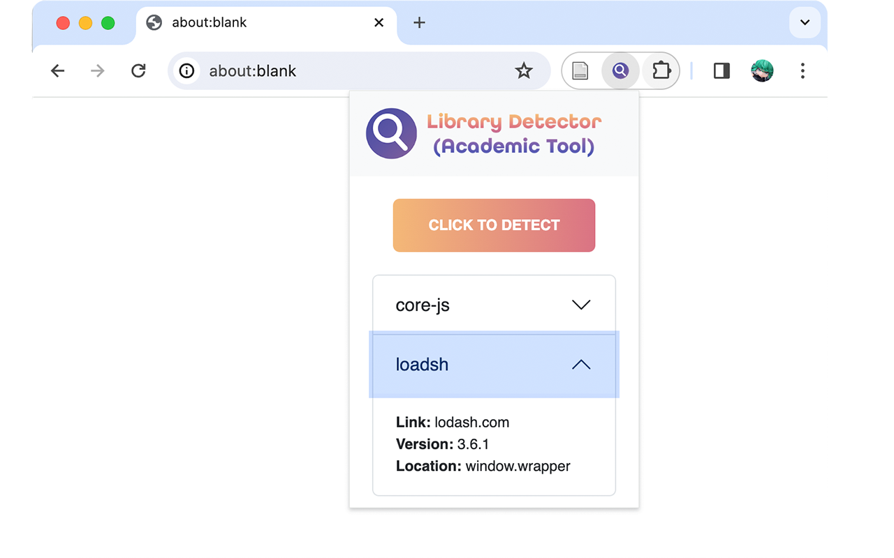
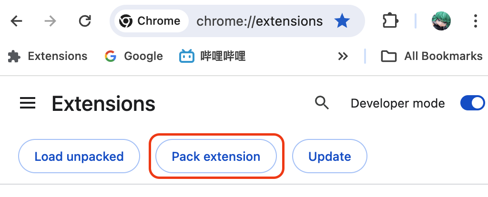

### Library Detector (Academic Tool)


#### What is this?

Library Detector (Academic Tool), **LD(AT)**, is a Chrome extension which can detect all JavaScript libraries runs behind the web and examine their versions. LD(AT) collects 1250 most popular libraries information from [cdnjs](https://cdnjs.com/). The complete library list can be found [here](https://github.com/aaronxyliu/PTV/blob/main/LIBLIST.md). The library detection ability has academic research support. More information please refer to the ASE 2023 paper [PTdetector: An Automated JavaScript Front-end Library Detector](https://www.researchgate.net/publication/373638073_PTDETECTOR_An_Automated_JavaScript_Front-end_Library_Detector).

#### How does it work?

LD(AT) applies pTree-based detection during the browser runtime. We collect pTree information for each library in advance and extract their valuable detection feature. The feature generation process is compeleted in the repository [PTV-gen](https://github.com/aaronxyliu/Anonymous).

#### How to use?

You can download this tool in the [Chrome Web Store](https://chromewebstore.google.com/detail/library-detector-academic/liedgiagjapaehficeimmjcemnknmdfp). Please give a kind rating if you think it is good to use!

For developers: open the Chrome browser, navigate to the `chrome://extensions/` site, click the "Load Unpacked" button to load this whole folder (need to swith on the developer mode). Then, pin it in the browser extensions menu.

In the popup, click the "detect" button. The detectioned libraries and corresponding versions will show. Sometimes, one library may relate to mutiple versions. In most cases (in fact, only except core-js), it means the correct version is one of them – the detector can not tell the minor difference between these versions.



#### How to automate the detection result collection?
1. Clone this repo
2. Change the value of variables `AUTO_DETECT` to `true` in the `content_scrtips/detect.js` file.
``` javascript
const AUTO_DETECT = true;
const AUTO_WAIT_TIME = 5;
```
Under such setting, this tool will send a signal to start the detection after 5 seconds when web page is loaded. The detection time and result will be stored in two created html elements with IDs of `lib-detect-result` and `lib-detect-time`, respectively.
4. Open Chrome, navigate to the `chrome://extensions/` site, click the "Pack extension" button to pack this repo, and name it "ldat.crx".

[](img/pack.png)
<!--  -->

5. Prepare Selenium and Chrome driver. Detail steps refer to guides in [PTV-gen](https://github.com/aaronxyliu/Anonymous).
6. Use following python code to open a web page and collect the detection result. Notice that the detection result is stored in JSON format.

``` python
from selenium.webdriver.chrome.options import Options
from selenium.webdriver.common.by import By
from selenium import webdriver
from selenium.webdriver.support.wait import WebDriverWait
from selenium.webdriver.support.expected_conditions import presence_of_element_located

# load this extension to the browser instance
opt = Options()
opt.add_extension(f'ldat.crx')
driver = webdriver.Chrome(executable_path="./bin/chromedriver", options=opt)

def retrieveInfo(url):
    # navigate to the url
    driver.get(url)    

    # wait until content appear in the element with id "lib-detect-result"
    WebDriverWait(driver, timeout=40).until(presence_of_element_located((By.XPATH, '//meta[@id="lib-detect-result" and @content]')))
    
    # read detection result and detection time
    result_str = driver.find_element(By.XPATH, '//*[@id="lib-detect-result"]').get_attribute("content")
    detect_time = driver.find_element(By.XPATH, '//*[@id="lib-detect-time"]').get_attribute("content")
    return result_str, detect_time
```

#### Contibution

Want to contribute? Feel free to contact **aaronxyliu@gmail.com**.


