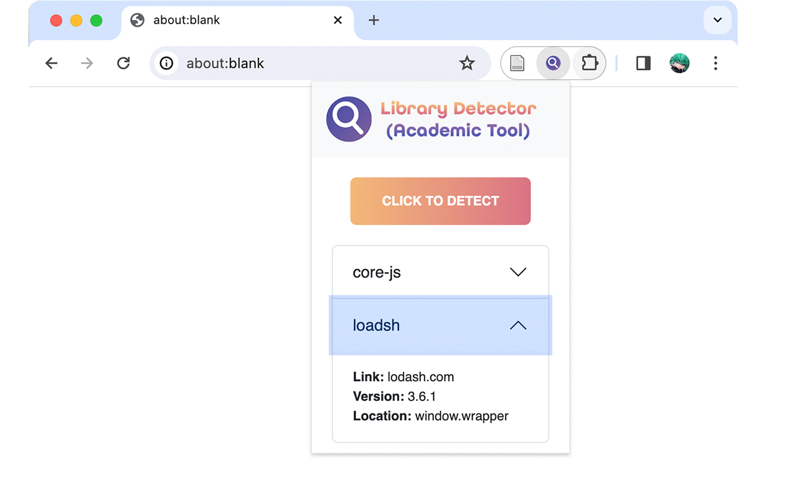

### Library Detector (Academic Tool)


#### What is this?

Library Detector (Academic Tool), **LD(AT)**, is a Chrome extension which can detect all JavaScript libraries runs behind the web and examine their versions. LD(AT) collects 1250 most popular libraries information from [cdnjs](https://cdnjs.com/). The complete library list can be found [here](https://github.com/aaronxyliu/PTV/blob/main/LIBLIST.md). The library detection ability has academic research support. More information please refer to the following papers:
- ASE'23: [PTdetector: An Automated JavaScript Front-end Library Detector](https://www.researchgate.net/publication/373638073_PTDETECTOR_An_Automated_JavaScript_Front-end_Library_Detector).
- ICSE'26: [PTV: Scalable Version Detection of Web Libraries and its Security Application](https://aaronxyliu.github.io/download/ptv-ready.pdf)

#### 🔥 Update News!
Want to use PTV to detect **bundled** libraries? Try this early-acess project: [aaronxyliu/PTV-bundle](https://github.com/aaronxyliu/PTV-bundle).

#### How does it work?

LD(AT) applies pTree-based detection during the browser runtime. We collect pTree information for each library in advance and extract their valuable detection feature. The feature generation process is compeleted in the repository [PTV-gen](https://github.com/aaronxyliu/Anonymous).

#### How to use?

You can download this tool in the [Chrome Web Store](https://chromewebstore.google.com/detail/library-detector-academic/liedgiagjapaehficeimmjcemnknmdfp). Please give a kind rating if you think it is good to use!

For developers: open the Chrome browser, navigate to the `chrome://extensions/` site, click the "Load Unpacked" button to load this whole folder (need to swith on the developer mode). Then, pin it in the browser extensions menu.

In the popup, click the "detect" button. The detectioned libraries and corresponding versions will show. Sometimes, one library may relate to mutiple versions. In most cases (in fact, only except core-js), it means the correct version is one of them – the detector can not tell the minor difference between these versions.



#### How to automate the detection result collection?
The recommended automation method is to load this repository as an **unpacked Chrome extension** with Puppeteer. Current Chrome/Selenium combinations may not reliably load a packed `PTV.crx`; in our tests, Puppeteer's `enableExtensions` option with pipe transport was the reliable method.

1. Clone this repository.

2. Make sure automatic detection is enabled in `content_scripts/inject.js`:

```javascript
const AUTO_DETECT = true;
const AUTO_WAIT_TIME = 4; // seconds
```

With this setting, PTV starts detection automatically after the page loads. The automation result is written into two meta elements:

```html
<meta id="lib-detect-result" content="...">
<meta id="lib-detect-time" content="...">
```

`lib-detect-result` stores a JSON string, and `lib-detect-time` stores the detection time in milliseconds.

3. Install Puppeteer Core in your automation project:

```bash
npm install puppeteer-core
```

4. Use the unpacked PTV directory directly:

```javascript
const path = require("path");
const puppeteer = require("puppeteer-core");

const chromePath = "/Applications/Google Chrome.app/Contents/MacOS/Google Chrome";
const ptvDir = path.resolve("PTV"); // this repository's root directory

async function retrieveInfo(url) {
  const browser = await puppeteer.launch({
    executablePath: chromePath,
    headless: false,
    pipe: true,
    enableExtensions: [ptvDir],
    args: [
      "--no-first-run",
      "--no-default-browser-check",
    ],
  });

  try {
    const page = await browser.newPage();
    await page.goto(url, {
      waitUntil: "domcontentloaded",
      timeout: 40000,
    });

    await page.waitForFunction(
      () => {
        const result = document.getElementById("lib-detect-result");
        return Boolean(result && result.getAttribute("content"));
      },
      { timeout: 40000 },
    );

    return await page.evaluate(() => {
      const result = document.getElementById("lib-detect-result");
      const time = document.getElementById("lib-detect-time");
      return {
        detected: JSON.parse(result.getAttribute("content") || "[]"),
        detectTimeMs: Number(time ? time.getAttribute("content") || 0 : 0),
      };
    });
  } finally {
    await browser.close();
  }
}

retrieveInfo("https://example.com/").then(console.log);
```

On Linux, `chromePath` is commonly one of:

```text
/usr/bin/google-chrome
/usr/bin/chromium
/usr/bin/chromium-browser
```

On macOS, it is commonly:

```text
/Applications/Google Chrome.app/Contents/MacOS/Google Chrome
```

#### Contibution

Want to contribute? Feel free to contact **aaronxyliu@gmail.com**.


